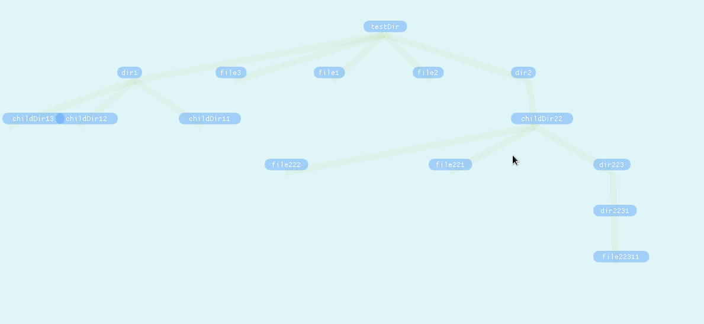
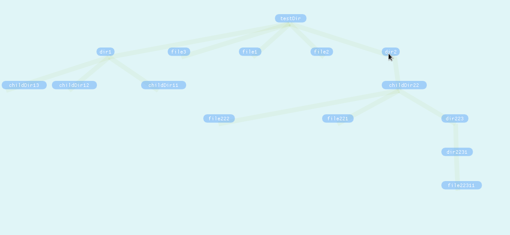
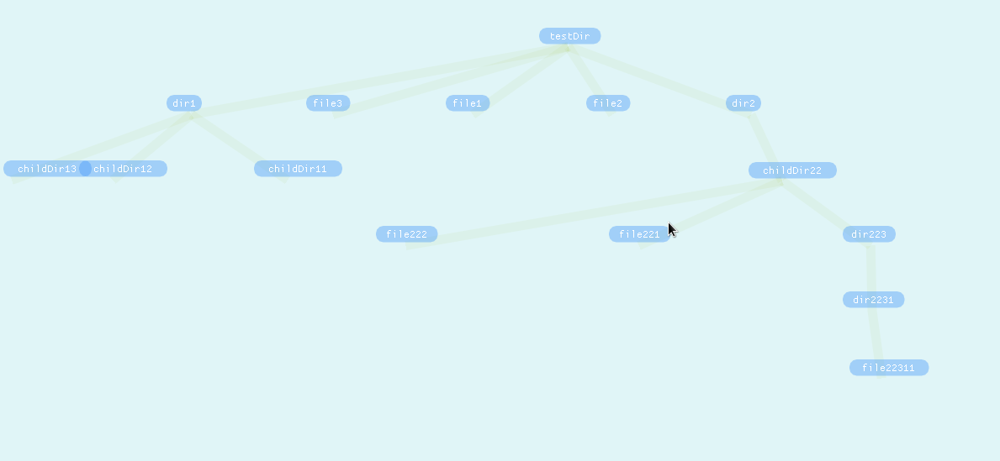
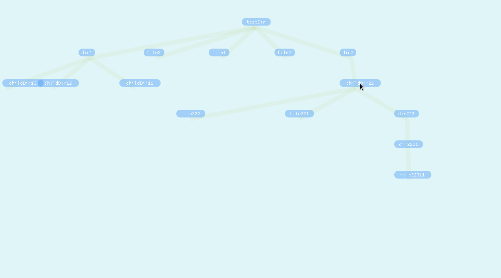

# DirViewer

A top-down tree like filesystem explorer. This is very much WiP and is not to be used on important files!
ImGui is used for drawing shapes and UI, and for the time being only Unices are supported (sorry :).

## Getting Started

1. Clone this repository `git clone https://github.com/JDuchniewicz/DirViewer.git`
2. Create a test directory structure (for testing purposes)
3. For now change `RootPath` variable in TreeController constructor to root folder of your liking
4. Build `make`
5. Run `./DirViewer`

### Prerequisites

All libraries are statically compiled to the binary.

### Current Features
#### Dragging

#### Collapsing nodes

#### Moving groups of nodes (like `mv`)

#### Adding and removing nodes

## License

This project is licensed under the MIT License - see the [LICENSE.md](LICENSE.md) file for details
